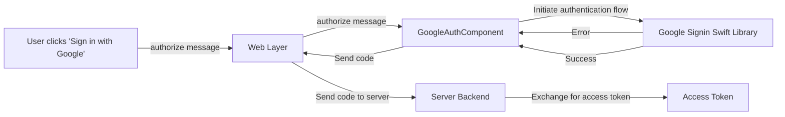

# Google Authentication with Hotwire Native

This repository contains a reference implementation for implementing Google
authentication using a [Hotwire Native](https://native.hotwired.dev/)
`BridgeComponent`. This implementation is based on the Google authentication
flow used by [Virtualtrails](https://virtualtrails.app).

The server backend is agnostic - it doesn't particularly matter as long as it
can accept an OAuth token to exchange for an access token, etc.

## OmniAuth

This particular example uses [omniauth](https://github.com/omniauth/omniauth),
in particular,
[omniauth-google-oauth2](https://github.com/zquestz/omniauth-google-oauth2).

If you are using OmniAuth, you will need to cofnigure the Google OAuth2 provider
to ignore state - this is because the authentication flow is initiated by the
Google Signin Swift library, not by visiting the `/auth/google_oauth2` endpoint.

Here is an example of the Google OAuth2 provider configuration for OmniAuth:

```ruby
google_credentials = Rails.application.credentials.google
if google_credentials
  google_options = [
    google_credentials.client_id, google_credentials.client_secret,
    { scope: "email,profile", name: :google, provider_ignores_state: true }
  ]
end

Rails.application.config.middleware.use OmniAuth::Builder do
  provider :google_oauth2, *google_options if google_credentials
end
```

## Markup example

This button is used to initiate the authentication flow. It will trigger the
normal web-based OAuth flow outside the iOS app, but will otherwise initiate a
native authentication flow using the Google Sign-in SDK.

```erb
<%= button_to "/auth/google_oauth2",
              data: {
                turbo: false,
                controller: "bridge--google-auth google",
                action: "bridge--google-auth#authorize"
              } do %>
  Sign-in with Google
<% end %>
```

## iOS application setup

To use Google Sign-in in your iOS app, you'll need to:

1. Install the Google Sign-in SDK using one of the methods described at
   https://developers.google.com/identity/sign-in/ios/start-integrating#swift-package-manager
   (I used Swift package manager).

2. Configure your iOS app in the Google Cloud Console:

   - Go to the [Google Cloud Console](https://console.cloud.google.com)
   - Create or select your project
   - Enable the Google Sign-in API
   - Configure the OAuth consent screen
   - Create iOS credentials and note your client ID

3. Add your reversed client ID to your Info.plist:

   ```xml
   <key>GIDClientID</key>
   <string>YOUR_REVERSED_CLIENT_ID</string>
   ```

4. Add the URL scheme to your Info.plist:

   ```xml
   <key>CFBundleURLTypes</key>
   <array>
     <dict>
       <key>CFBundleURLSchemes</key>
       <array>
         <string>YOUR_REVERSED_CLIENT_ID</string>
       </array>
     </dict>
   </array>
   ```

5. Initialize Google Sign-in in your AppDelegate:

   ```swift
   import GoogleSignIn

   func application(
      _ app: UIApplication,
      open url: URL, options: [UIApplication.OpenURLOptionsKey : Any] = [:]
    ) -> Bool {
      var handled: Bool

      handled = GIDSignIn.sharedInstance.handle(url)
      if handled {
        return true
      }

      // Handle other custom URL types.

      // If not handled by this app, return false.
      return false
   }
   ```

6. Configure the following Info.plist keys:
7. `GIDClientID` - your Google client ID
8. `GIDServerClientID` - your Google server (the one you use for OmniAuth etc)
   client ID
9. Add your reversed client ID to the `CFBundleURLTypes` array.

## How does this component work?

BridgeComponents essentially just formalise a message passing interface between
the native and web layers.

The `GoogleAuthComponent` is a `BridgeComponent` that implements the `authorize`
message. This message is sent from the web layer to the native layer when the
user clicks the "Sign in with Google" button.

The `GoogleAuthComponent` then uses the Google Signin Swift library to initiate
the authentication flow. If an error occurs, the `GoogleAuthComponent` will send
a `authorize` message back to the web layer with the error.

If the authentication flow is successful, the `GoogleAuthComponent` will send a
`authorize` message back to the web layer with the code.

This code is then sent to the server backend to exchange for an access token.
This is essentially the same flow followed by a normal web-based OAuth flow,
which means that your backend OAuth callback code will be the same - you can
handle Google auth originating from web OR native sign-in experiences.



## Support

Please understand that **this is not a library**, and it may not work for you
out of the box - it's intended to be a reference implementation for how to
implement Google authentication with Hotwire Native, not a drop-in solution.

Having said that, I hope that it helps you get started with Google
authentication in your Hotwire Native app. If you spot any issues, please feel
free to raise an issue or submit a pull request.

## License

MIT License

Copyright (c) 2024

Permission is hereby granted, free of charge, to any person obtaining a copy of
this software and associated documentation files (the "Software"), to deal in
the Software without restriction, including without limitation the rights to
use, copy, modify, merge, publish, distribute, sublicense, and/or sell copies of
the Software, and to permit persons to whom the Software is furnished to do so,
subject to the following conditions:

The above copyright notice and this permission notice shall be included in all
copies or substantial portions of the Software.

THE SOFTWARE IS PROVIDED "AS IS", WITHOUT WARRANTY OF ANY KIND, EXPRESS OR
IMPLIED, INCLUDING BUT NOT LIMITED TO THE WARRANTIES OF MERCHANTABILITY, FITNESS
FOR A PARTICULAR PURPOSE AND NONINFRINGEMENT. IN NO EVENT SHALL THE AUTHORS OR
COPYRIGHT HOLDERS BE LIABLE FOR ANY CLAIM, DAMAGES OR OTHER LIABILITY, WHETHER
IN AN ACTION OF CONTRACT, TORT OR OTHERWISE, ARISING FROM, OUT OF OR IN
CONNECTION WITH THE SOFTWARE OR THE USE OR OTHER DEALINGS IN THE SOFTWARE.
